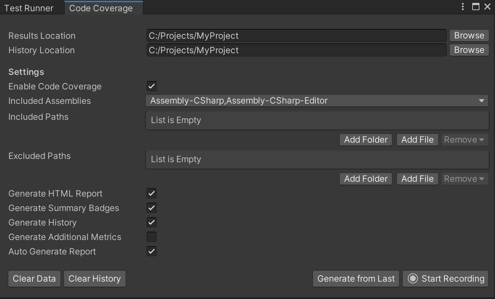

# Code Coverage window

|**Property**|**Description**|
|:---|:---|
|Results Location|Select the **Browse** button to specify the folder where the coverage results and report will be saved to. The default destination is the Project's folder.|
|History Location|Select the **Browse** button to specify the folder where the coverage report history will be saved to. The default destination is the Project's folder.|
|**Settings**|
|Enable Code Coverage|Check this to enable Code Coverage. This is required in order to generate Coverage data and reports. Note that Code Coverage can affect the Editor performance.|
|Included Assemblies|Specify assemblies to be included in the coverage results. This is a dropdown list containing the available assemblies. Click the dropdown to view, select or deselect the assemblies. All assemblies can be selected and deselected at once by expanding the list and using the **Select All** or **Deselect All** buttons.
|Included Paths|Specify individual folders and files to only be included in coverage results by using the **Add Folder** and **Add File** buttons respectively. Leaving the list empty will include all files from the **Included Assemblies**. Globbing can be used to filter the paths. Individual list entries can be removed by selecting an entry and using **Remove > Remove Selected**. The list can be cleared using **Remove > Remove All**.|
|Excluded Paths|Specify individual folders and files to be excluded from coverage results by using the **Add Folder** and **Add File** buttons respectively. Globbing can be used to filter the paths. Individual entries can be removed by selecting an entry and selecting **Remove > Remove Selected**. The list can be cleared using **Remove > Remove All**.|
|Generate HTML Report|Check this to generate an HTML report.|
|Generate Summary Badges|Check this to generate coverage summary badges in SVG and PNG format.|
|Generate History|Check this to generate and include the coverage history in the HTML report.|
|Generate Additional Metrics|Check this to generate and include additional metrics in the HTML report. These currently include Cyclomatic Complexity and Crap Score calculations for each method. See the [Risk Hotspots](HowToInterpretResults.md#risk-hotspots) section for more information.|
|Auto Generate Report|Check this to generate the report automatically after the [Test Runner](CoverageTestRunner.md) finishes running or the [Coverage Recording](CoverageRecording.md) session is complete.|
|Clear Data|Select the **Clear Data** button to clear the coverage data from previous test runs or from previous [Coverage Recording](CoverageRecording.md) sessions. The **Clear Data** button is disabled if the coverage data is cleared, if no tests ran, or if there is no Coverage Recording data.|
|Clear History|Select the **Clear History** button to clear the coverage report history. The **Clear History** button is disabled if the history is cleared or if no reports were generated.|
|Generate from Last|Select the **Generate from Last** button to generate a coverage report from the last set of tests that were run in the [Test Runner](CoverageTestRunner.md) or from the last [Coverage Recording](CoverageRecording.md) session. Note that the **Generate from Last** button is disabled if no tests ran, there is no Coverage Recording data or both **Generate HTML Report** and **Generate Summary Badges** are unchecked.|
|Start Recording|Select the **Start Recording** button to start [recording](CoverageRecording.md) coverage data.|
|Stop Recording|Select the **Stop Recording** button to stop [recording](CoverageRecording.md) coverage data.|
