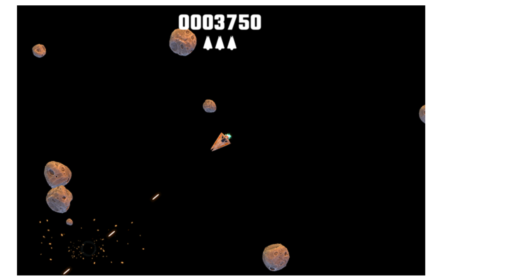
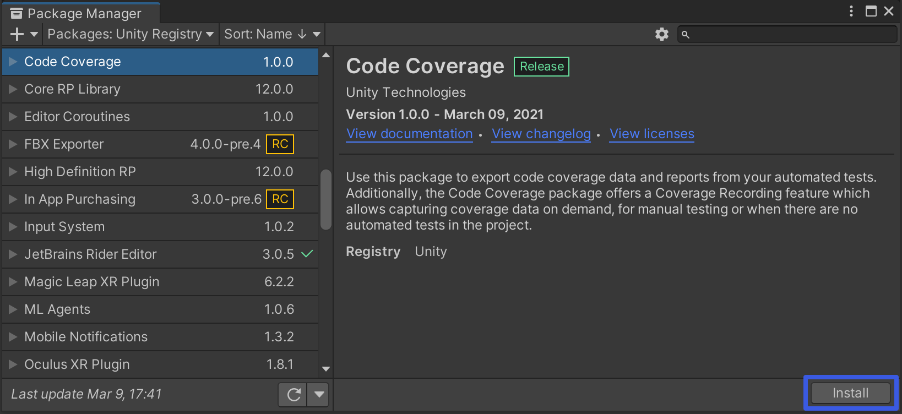
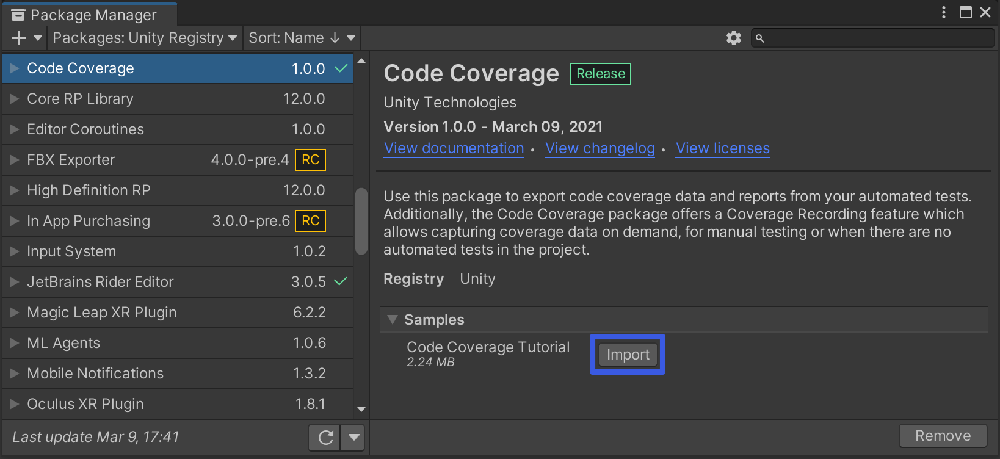
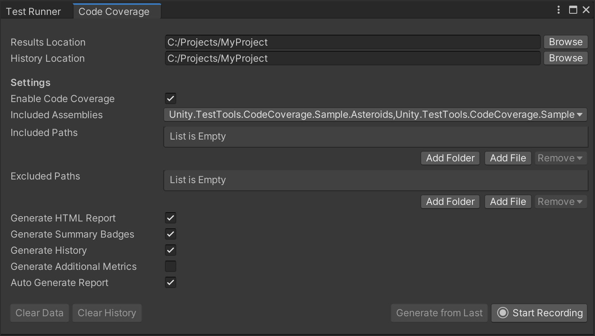
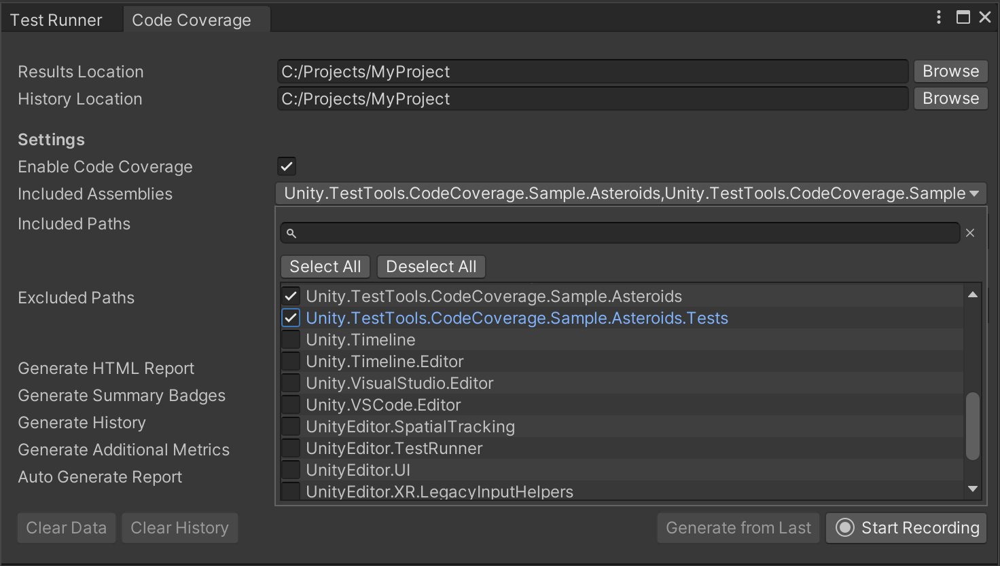
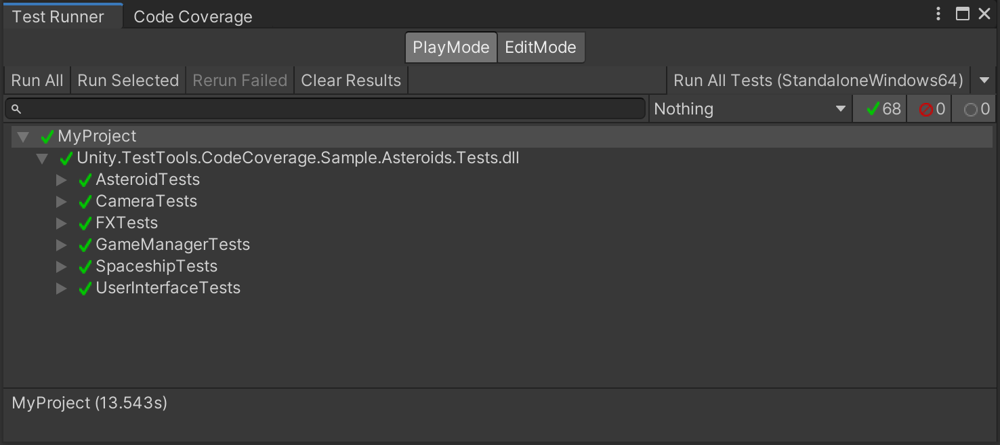
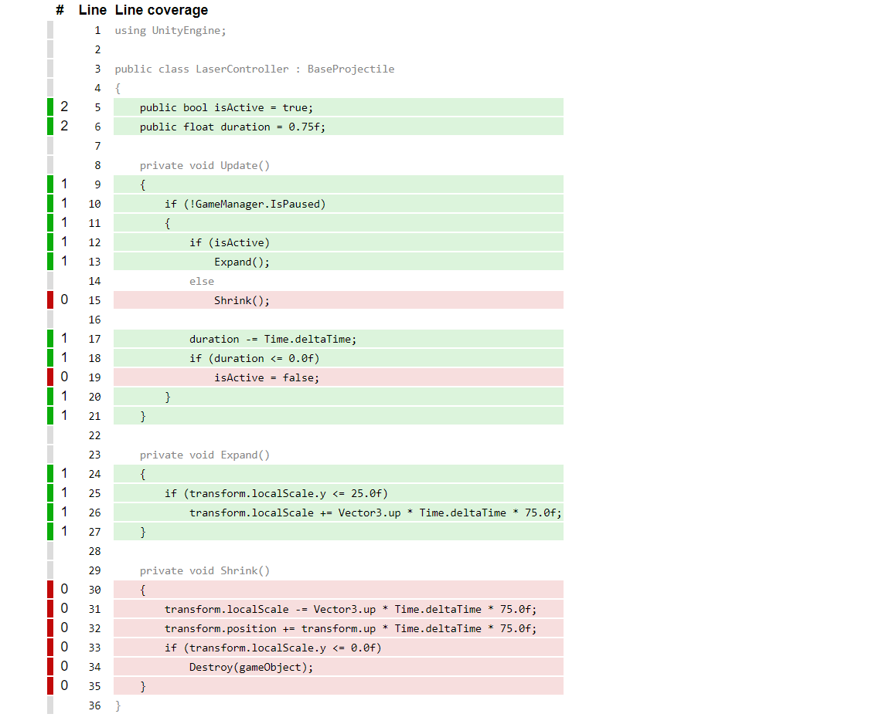

# Quickstart - Code Coverage Tutorial

The Quickstart guide will give you an insight into what Code Coverage is and how you can identify areas of your code that need more testing, even if you haven't written any automated tests. It takes about **30 minutes** to complete.



## Tasks

1. [What is Code Coverage](#1-what-is-code-coverage-sub2-minsub) (2 min)  
2. [Install the Code Coverage package](#2-install-the-code-coverage-package-sub2-minsub) (2 min)  
3. [Install the Asteroids sample project](#3-install-the-asteroids-sample-project-sub1-minsub) (1 min)  
4. [Enable Code Coverage](#4-enable-code-coverage-sub1-minsub) (1 min)  
5. [Understanding the game code: Shoot() function](#5-understanding-the-game-code-shoot-function-sub4-minsub) (4 min)  
6. [Generate a Coverage report from PlayMode tests](#6-generate-a-coverage-report-from-playmode-tests-sub3-minsub) (3 min)  
7. [Add Weapon tests to improve coverage](#7-add-weapon-tests-to-improve-coverage-sub3-minsub) (3 min)  
8. [Add a test for the LaserController](#8-add-a-test-for-the-lasercontroller-sub4-minsub) (4 min)  
9. [Clear the coverage data](#9-clear-the-coverage-data-sub1-minsub) (1 min)  
10. [Generate a Coverage report using Coverage Recording](#10-generate-a-coverage-report-using-coverage-recording-sub4-minsub) (4 min)

**Note:** Estimated times are shown for each task to give you a better understanding of the time required. These times are rough guidelines - it is fine to take as much or as little time as needed.

## 1. What is Code Coverage <sub>*(2 min)*</sub>

[Code Coverage](https://en.wikipedia.org/wiki/Code_coverage) is a measure of how much of your code has been executed. It is normally associated with automated tests, but you can gather coverage data in Unity at any time when the Editor is running.

It is typically presented as a [report](HowToInterpretResults.md) that shows the percentage of the code that has been executed. For automated testing the report does not measure the quality of tests, only whether your code is executed by PlayMode and EditMode tests. It is especially useful to check that critical or high risk areas of your code are covered, because they should receive the most rigorous testing.

It is much easier to accidentally introduce bugs into code that is not covered by tests, because those bugs are not detected straight away by the tests and can instead cause problems later — such as after you have published your game or app.

Additionally, the Code Coverage package offers a [Coverage Recording](CoverageRecording.md) feature which allows capturing coverage data on demand, in case you do not have tests in your project or doing manual testing.

## 2. Install the Code Coverage package <sub>*(2 min)*</sub>
*Skip this task if the package is already installed.*

Use the [Unity Package Manager](https://docs.unity3d.com/Packages/com.unity.package-manager-ui@latest) to find and install the **Code Coverage** package.



Alternatively, use the Add(+) dropdown and select **Add package from git URL...** or **Add package by name...** and type `com.unity.testtools.codecoverage`.


To verify that Code Coverage has been installed correctly, open the Code Coverage window (go to **Window** > **Analysis** > **Code Coverage**). If you don't see the **Code Coverage** menu item, then Code Coverage did not install correctly.

## 3. Install the Asteroids sample project <sub>*(1 min)*</sub>

1. In the [Unity Package Manager](https://docs.unity3d.com/Packages/com.unity.package-manager-ui@latest) (**Window** > **Package Manager**) select the **Code Coverage** package, if not already selected.
2. Find the **Samples** section in the package details (right hand side) and select **Import** next to **Code Coverage Tutorial**.<br/><br/>


## 4. Enable Code Coverage <sub>*(1 min)*</sub>

To enable Code Coverage open the [Code Coverage window](CodeCoverageWindow.md) (go to **Window** > **Analysis** > **Code Coverage**) and select **Enable Code Coverage** if not already selected, to be able to generate Coverage data and reports.


**Note:** Enabling Code Coverage adds some overhead to the editor and can affect the performance.

## 5. Understanding the game code: Shoot() function <sub>*(4 min)*</sub>

1. Go to `Asteroids/Scenes` in Project View and open the **Asteroids** scene.<br/>
This is located in `Assets/Samples/Code Coverage/<version>/Code Coverage Tutorial`.

2. Hit **Play** and play the game for a minute or two.<br/>

Use the arrow keys to move and spacebar to shoot.

3. Exit PlayMode.

4. Open the `Scripts/Controllers/SpaceshipController.cs` script.

5. Study the **Shoot** function.
```
If Weapon is Basic, the Prefabs/Weapons/Projectile prefab is instantiated
If Weapon is Laser, the Prefabs/Weapons/Laser prefab is instantiated
```

## 6. Generate a Coverage report from PlayMode tests <sub>*(3 min)*</sub>

1. Open the [Code Coverage window](CodeCoverageWindow.md) (go to **Window** > **Analysis** > **Code Coverage**).<br/><br/>


2. If you see this warning select **Switch to debug mode**.<br/>

[Code Optimization](https://docs.unity3d.com/2020.1/Documentation/Manual/ManagedCodeDebugging.html#CodeOptimizationMode) was introduced in Unity 2020.1; in _Release mode_ the code is optimized and therefore not directly represented by the original code. Therefore, _Debug mode_ is required in order to obtain accurate code coverage information.

3. Click the **Included Assemblies** dropdown to make sure only<br/>
`Unity.TestTools.CodeCoverage.Sample.Asteroids` and<br/>
`Unity.TestTools.CodeCoverage.Sample.Asteroids.Tests` are selected.<br/><br/>


4. Make sure **Generate HTML Report**, **Generate History** and **Auto Generate Report** are all checked.


5. Switch to the [Test Runner](https://docs.unity3d.com/Packages/com.unity.test-framework@latest/index.html?subfolder=/manual/workflow-run-test.html) window, select the **PlayMode** tab and hit **Run All** tests.<br/><br/>


6. When the tests finish running, a file viewer window will open up containing the coverage report. Select `index.htm`.

7. Look for the classes with low coverage, especially **LaserController**, **BaseProjectile** and **ProjectileController**.

You can sort the results by _Line coverage_.


See also [How to interpret the results](HowToInterpretResults.md).

## 7. Add Weapon tests to improve coverage <sub>*(3 min)*</sub>

1. Open the `Tests/WeaponTests.cs` script.

2. Uncomment all the tests (from _line 35_ down to _line 237_).

3. Back in the **Test Runner**, hit **Run All** tests again.

4. When the tests finish running, a file viewer window will open up containing the coverage report. Select `index.htm`.

5. Notice that now **BaseProjectile** and **ProjectileController** coverage is considerably higher, but **LaserController** has not improved much.


## 8. Add a test for the LaserController <sub>*(4 min)*</sub>

1. Open the `Tests/WeaponTests.cs` script.

2. Go to the **\_18\_LaserFiresSuccessfully** test in _line 225_.

3. Uncomment and study the code.

4. Back in the **Test Runner**, hit **Run All** tests again.

5. When the tests finish running, a file viewer window will open up containing the coverage report. Select `index.htm`.

6. Notice how the coverage for **LaserController** has improved.<br/>


7. Select the **LaserController** class to enter the class view and notice that about 2/3 (65%) of the code is now covered (green).



Complete the [Bonus Task](#11-bonus-task-sub5-8-minsub) at the end of the tutorial to get 100% coverage!

## 9. Clear the coverage data <sub>*(1 min)*</sub>

1. Open the [Code Coverage window](CodeCoverageWindow.md) (go to **Window** > **Analysis** > **Code Coverage**).

2. Select **Clear Data** and confirm.

3. Select **Clear History** and confirm.

## 10. Generate a Coverage report using Coverage Recording <sub>*(4 min)*</sub>

1. Go to `Asteroids/Scenes` in Project View and open the **Asteroids** scene, if not opened already.

2. Open the [Code Coverage window](CodeCoverageWindow.md). Make sure **Generate HTML Report**, **Generate History** and **Auto Generate Report** all are checked.<br/>


3. Select **Start Recording**.<br/>


4. Hit **Play** to play the game and **exit** PlayMode before you get **8000** points.


5. Select **Stop Recording**.<br/>


6. A file viewer window will open up containing the coverage report. Select `index.htm`.

7. Notice that **LaserController** has 0% coverage.<br/>


8. Go back to the **Code Coverage window**.

9. Select **Start Recording**.

10. Now hit **Play** to play the game again but this time **exit** PlayMode when you get **8000** points.

11. Select **Stop Recording**.

12. Notice that **LaserController** coverage is now 100%.<br/>


See also [How to interpret the results](HowToInterpretResults.md).
<br/><br/>

## 11. Bonus task <sub>*(5-8 min)*</sub>

Write a new test that checks that the laser gets destroyed after 2 seconds, which will also cover the rest of the code in **LaserController**.

**Suggested name:** _19_LaserFiresAndIsDestroyedAfterTwoSeconds.  
**Hint:** You can use `yield return new WaitForSeconds(2f);` to wait for 2 seconds.

<br/>

---

<br/>

### Well done for finishing the Code Coverage Tutorial!

For questions and feedback please reach out to us in the dedicated Code Coverage package [forum thread](https://forum.unity.com/threads/code-coverage-package.777542/).
