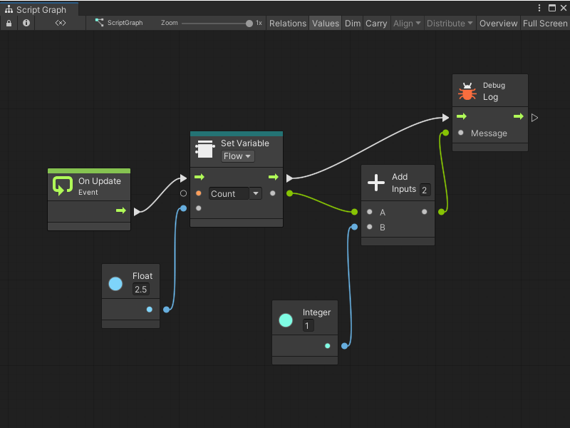

# Connect nodes in a Script Graph 

Connections control the flow of logic and data in a Script Graph's nodes. 

To connect nodes in a Script Graph: 

1. With a Script Graph [open in the Graph window](vs-open-graph-edit.md), either find an existing node where you want to make a connection, or [add a new node to your Script Graph](vs-add-node-to-graph.md).

1. Do one of the following: 
    - [Connect to a new node](#connect-to-a-new-node).
    - [Connect to an existing node](#connect-to-an-existing-node).

### Connect to a new node

1. Select a port and point to a blank area in your graph to start the connection. 

1. Select again to open the fuzzy finder.

1. Select an entry to automatically add that node at the end of your connection. 

### Connect to an existing node

1. Select a port and point to an existing port on another node.

1. Select the port to make the connection. 

## Delete a connection

To delete a connection between two nodes: 

1. With a Script Graph open in the Graph window, right-click the port at either end of a connection.

Visual Scripting deletes the connection. 

## Next steps 

Once you've connected nodes together, you can continue to [add nodes to your Script Graph](vs-add-node-to-graph.md). You can also [create and add variables](vs-add-variable-graph.md), [create node groups](vs-groups.md), or [add a Subgraph](vs-nesting-add-subgraph.md).